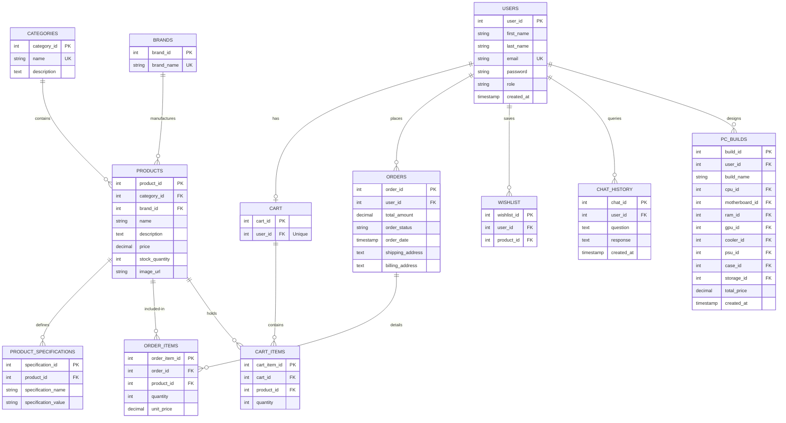
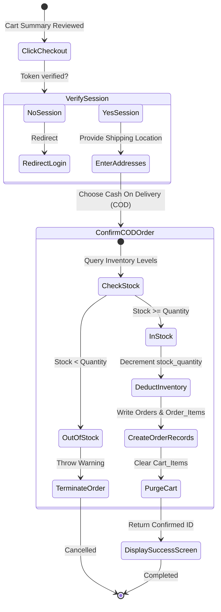
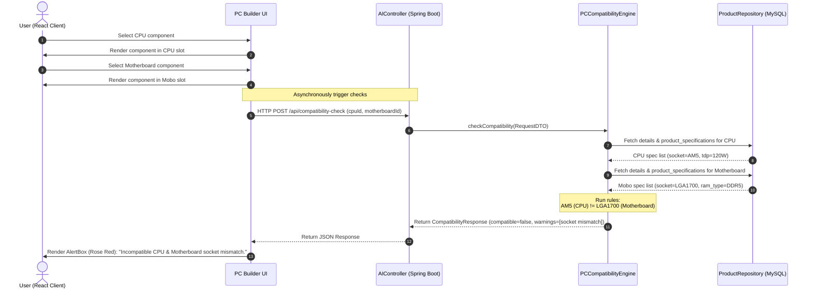
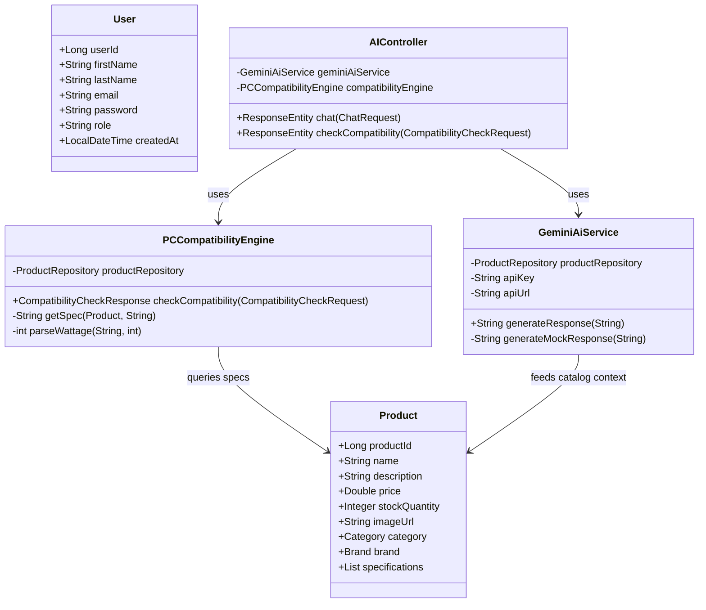

# System Architecture & Design Diagrams

This document contains visual diagrams for the **Computer Hardware E-Commerce Website with AI Assistant**. These diagrams are formatted in **Mermaid.js** syntax and render natively in modern Markdown viewers.

---

## 1. System Architecture Diagram

```mermaid
graph TD
    subgraph Client Layer
        React[React.js SPA]
        CSS[Vanilla CSS / Glassmorphic Layout]
        Axios[Axios API Client]
        React --> Axios
    end

    subgraph Security & Route Gateway
        JWT[JWT Authentication Filter]
        SecConfig[Spring Security Config]
    end

    subgraph Backend Logic Layer (Spring Boot)
        AuthCtrl[AuthController]
        ProdCtrl[ProductController]
        OrderCtrl[OrderController]
        AICtrl[AIController]
        
        UserService[UserService]
        ProdService[ProductService]
        OrderService[OrderService]
        CompatEngine[PCCompatibilityEngine]
        GeminiService[GeminiAiService]
    end

    subgraph Data & External Services
        MySQL[(MySQL Database 3NF)]
        GeminiAPI[Gemini 1.5 Flash API]
    end

    Axios -->|Bearer Token| JWT
    JWT --> SecConfig
    SecConfig --> AuthCtrl
    SecConfig --> ProdCtrl
    SecConfig --> OrderCtrl
    SecConfig --> AICtrl

    AuthCtrl --> UserService
    ProdCtrl --> ProdService
    OrderCtrl --> OrderService
    AICtrl --> CompatEngine
    AICtrl --> GeminiService

    UserService --> MySQL
    ProdService --> MySQL
    OrderService --> MySQL
    CompatEngine --> MySQL
    GeminiService -->|HTTP POST| GeminiAPI
```

---

## 2. Entity Relationship Diagram (ERD)

Representing normalized database relationships in Crow's Foot style mapping primary and foreign keys:



---

## 3. Use Case Diagram

```mermaid
left-to-right direction
actor Customer as "Customer Role"
actor Admin as "Administrator Role"

rectangle Platform {
    usecase UC_Register as "Register & Login"
    usecase UC_Browse as "Browse / Search Products"
    usecase UC_PCBuilder as "Configure Custom PC"
    usecase UC_AIChat as "Consult Gemini Assistant"
    usecase UC_Cart as "Manage Shopping Cart"
    usecase UC_Checkout as "Check Out Order"
    usecase UC_Orders as "Track Purchase History"
    
    usecase UC_AdminProducts as "Manage Store Catalog (CRUD)"
    usecase UC_AdminOrders as "Update Order Status"
    usecase UC_AdminAlerts as "Monitor Low Stock Alerts"
}

Customer --> UC_Register
Customer --> UC_Browse
Customer --> UC_PCBuilder
Customer --> UC_AIChat
Customer --> UC_Cart
Customer --> UC_Checkout
Customer --> UC_Orders

Admin --> UC_Register
Admin --> UC_AdminProducts
Admin --> UC_AdminOrders
Admin --> UC_AdminAlerts
```

---

## 4. Activity Diagram - Checkout Workflow



---

## 5. Sequence Diagram - PC Compatibility Check



---

## 6. Class Diagram (Core Backend Classes)


